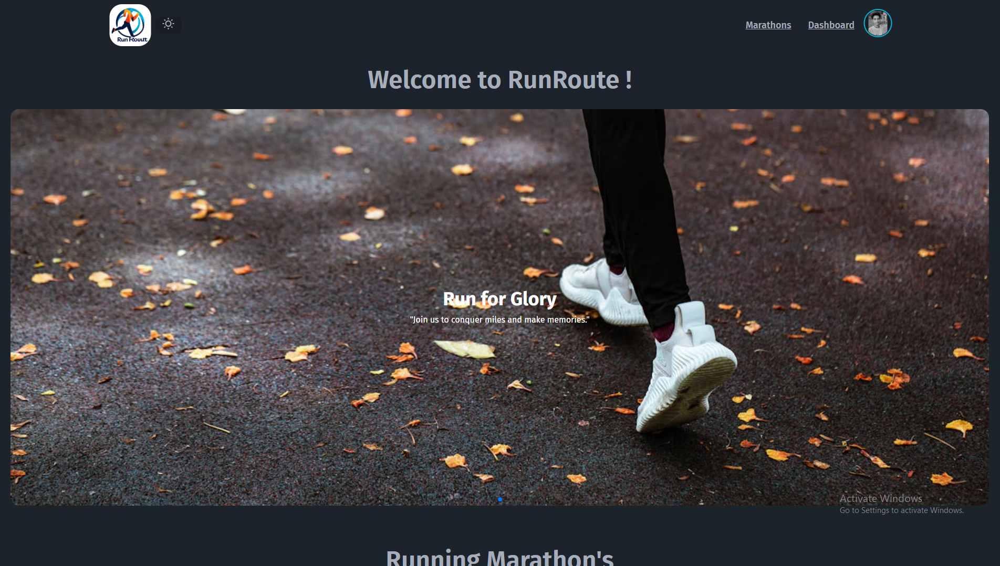

# RunRoute - Marathon Management System

## Project Overview

RunRoute is a comprehensive Marathon Management System designed to streamline the process of organizing, tracking, and managing marathons. Whether you're a participant or an organizer, this platform simplifies registration, race tracking, and results management.

## Screenshot



## Technologies Used

- **Frontend:** React.js, TailwindCSS
- **Backend:** Node.js, Express.js
- **Database:** MongoDB
- **Authentication:** JWT (JSON Web Tokens)
- **Other:** dotenv for environment variables

## Core Features

- **User Registration & Authentication**: Secure sign-up and login for runners and organizers.
- **Event Listings**: Organizers can list upcoming marathons with race details and locations.
- **Participant Registration**: Runners can easily register for events.
- **Race Results Tracking**: Real-time race results and statistics for each runner.

## Core Features (Coming Soon)

- **Admin Panel**: Organizers can manage events, registrations, and track participants' progress.  (Under Develop)
- **Real-time Updates**: Live race updates for participants and event organizers.  (Under Develop)

## Dependencies

- `react`: React framework for building the user interface.
- `express`: Web server framework for handling backend requests.
- `mongoose`: MongoDB object modeling for Node.js.
- `jsonwebtoken`: JWT-based authentication.
- `dotenv`: Loads environment variables from `.env` files.
- `tailwindcss`: Utility-first CSS framework for styling.

## Running the Project Locally

### Prerequisites:

- Node.js (version 14 or higher)
- MongoDB (local or cloud instance)

### Step-by-Step Guide:

1. **Clone the Repository:**

   ```bash
   git clone https://github.com/sheikhmuhammadantor/runroute-client
   ```

2. **Navigate to the project folder:**

   ```bash
   cd runroute-client
   ```

3. **Install the dependencies:**

   ```bash
   npm install
   ```

4. **Set up environment variables:**
   Create a `.env.local` file and add your environment variables, e.g., MongoDB URI, JWT secret.

5. **Start the server:**

   ```bash
   npm run dev
   ```

6. **Access the project:**
   Open your browser and go to `http://localhost:5173`.

## Live Project Links & Resources:

- **Live Demo:** [RunRoute Demo](https://runroute.netlify.app/)
- **Server Repository:** [RunRoute Server](https://github.com/sheikhmuhammadantor/runroute-server)
